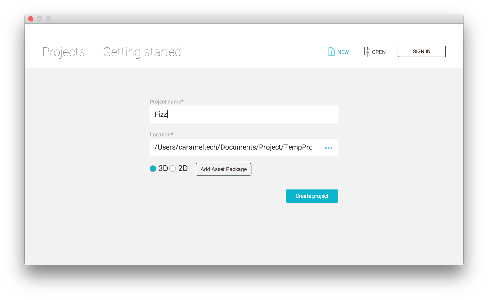

# Getting Started

## Getting started with server integration

### Create unique user IDs
Skip this step if you have internal unique user IDs for your user base.

Fizz requires a unique ID for each user. It is recommended that you have an API which generates unique IDs for your users. Fizz server will not be called in this instance.

### Get user token
You can get a unique user token against each ID that is generated in first step. Please refer to [Authentication and Initialization](authentication_and_initialization) for details.

## Getting started on Unity
You will need to start with creating a Fizz application ID for your application. The application ID will be used to configure your Fizz SDK within Unity.

### Create your application on Fizz
In order to create your application on Fizz, you have to contact Fizz management.

#### Add SDK to your Unity project

* Step 1: Create a new project in Unity Editor.

<i>FIZZUISDK</i> instance can be null if it’s not present in the scene, so you have to check that whenever you are launching Fizz UI. For launching Fizz UI you can use the following piece of code.

<pre class="prettyprint unity">
if (FIZZUISDK.Instance != null)
	FIZZUISDK.Instance.LaunchFizz ();
</pre>